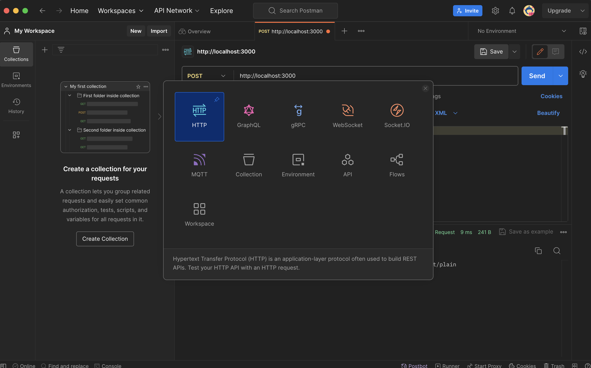
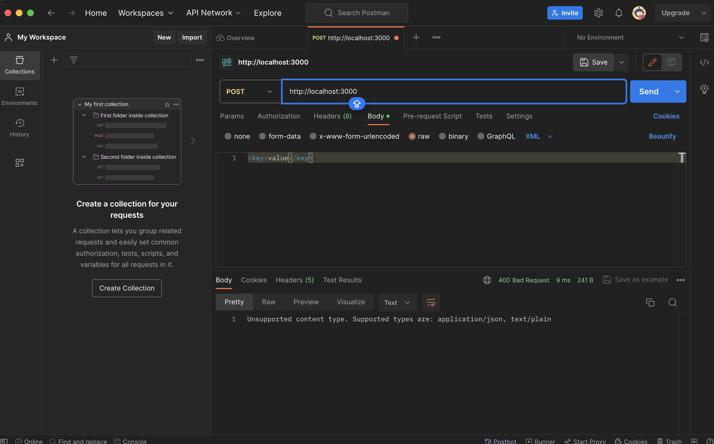
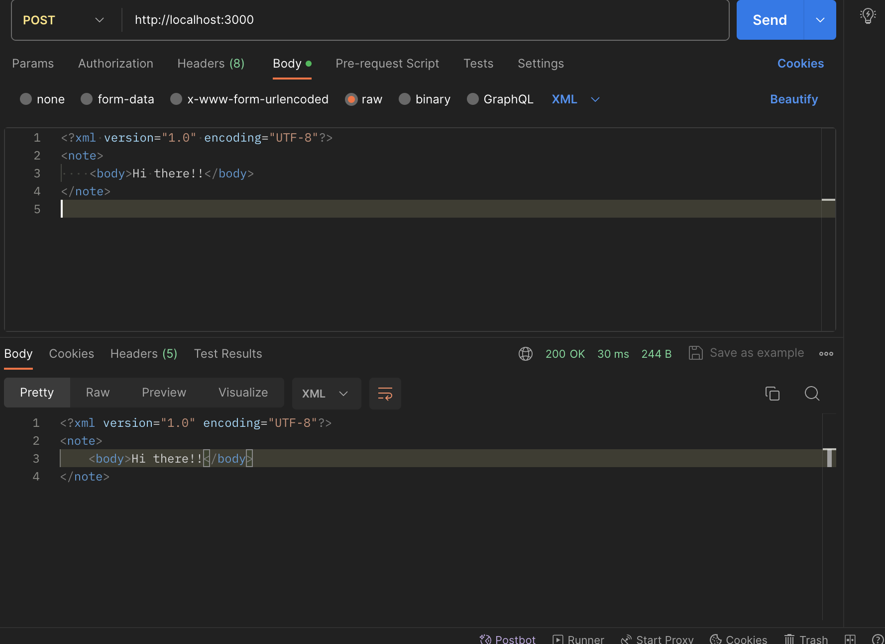
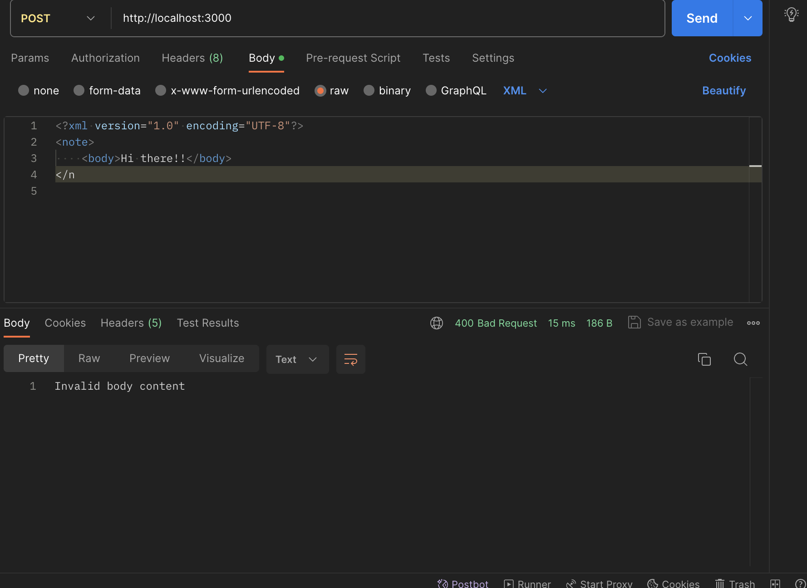
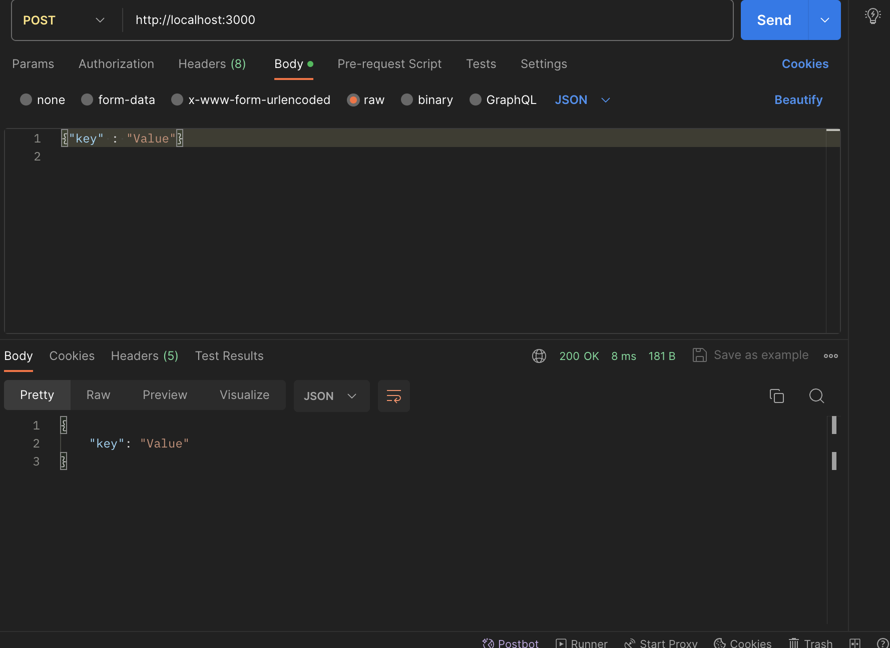
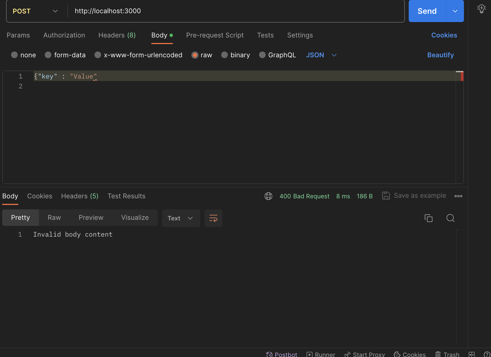
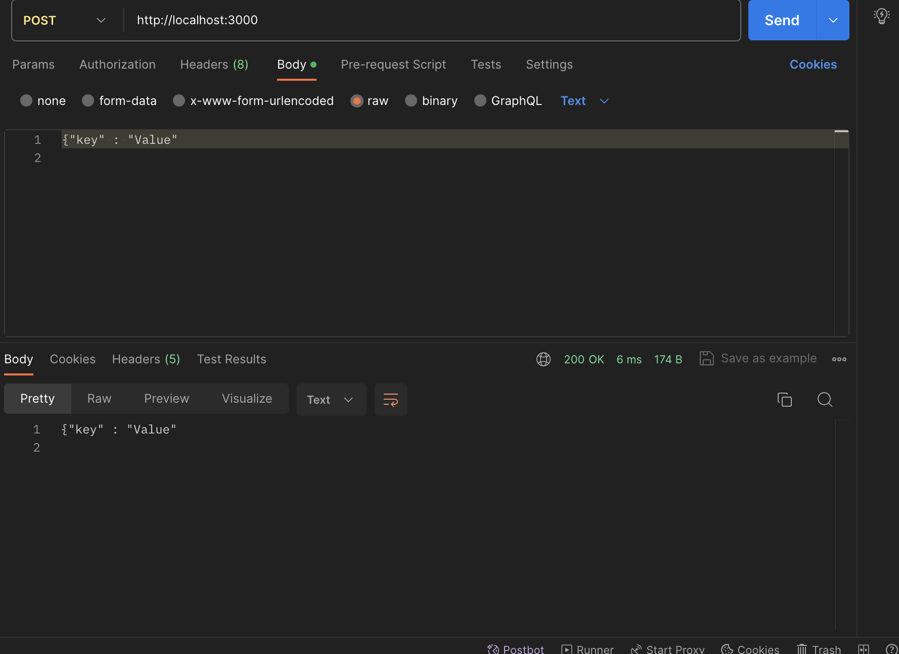

# Application server that accepts HTTP requests

## Steps to setup

1. Setup nodejs by implementing the following command:\
`npm init -y`

2. Installing jasmine:\
`npm install --save-dev jasmine`\
`npx jasmine init`\
(I have added the relative path of jasmine bin path to the test packages in package.json\
if it doesn't work for somereason please check the path for jasmine bin file and add it to the package.json file)

3. Use message_bounserver.js file to initialize the server that takes POST request for a spesific\
file format and if a separate file format is recieved it responses with an error message:\
\
To start the server:\
`node message_bounserver.js`\
\
I am using Port:3000 but you can chnage the port to your liking by chnaging the variable "`const PORT`"\
Now that the server is running we can test it using jasmine and postman

4. Testing using Jasmine:\
We can test using jasmine by running `npm test` command in the terminal. \
I have implemented 7 testcases:\
1st - 4th(error in format for xml, json, missing content type) are error cases where the server request returns with an error\
5th - 7th are success cases where the server return with the content of the file\
If you are having issues with port please confirm if that port is free and try again\
You can also test using Postman by following the step below

5. Testing using Postman:\
Open Postman and click on add button in workspace to add the type of testing request.\
\
\
.\
.\
.\
You can see in the image that you get multiple options to select from\
We need to select http inorder to test our code\
.\
.\
.\

.\
.\
.\
We selete POST and then add our url `http://localhost:3000`\
We then go to body select raw and type of content file\
We can add the content in the text box below and then hit send

### Testcase 1
\
### Testcase 2
\
### Testcase 3
\
### Testcase 4
\
### Testcase 5
\